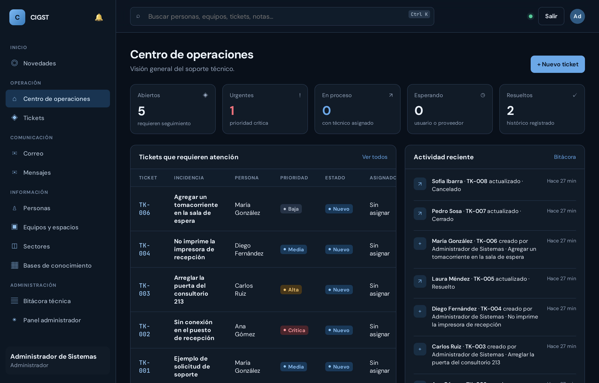
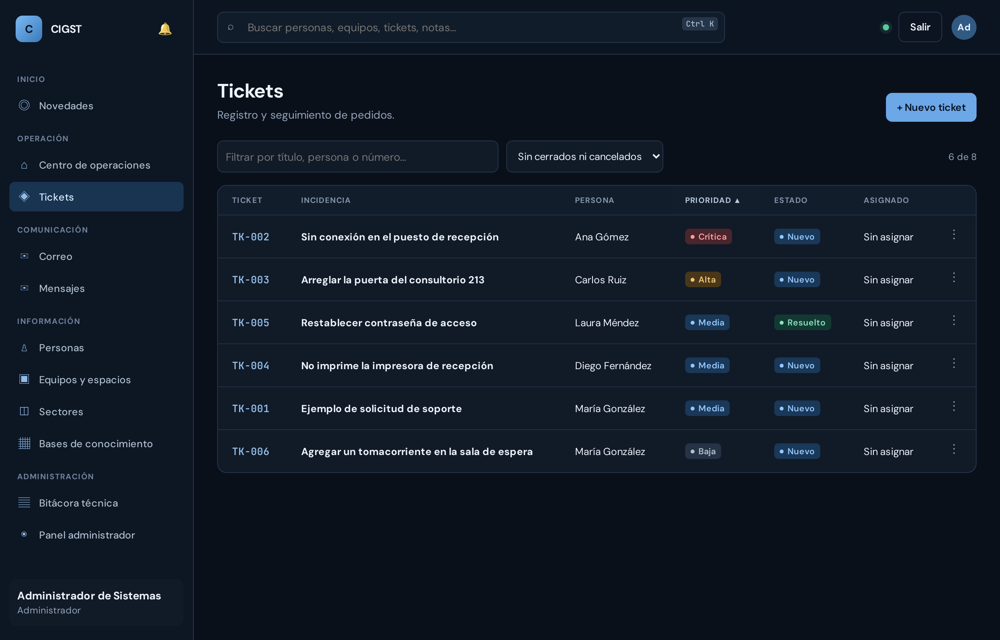
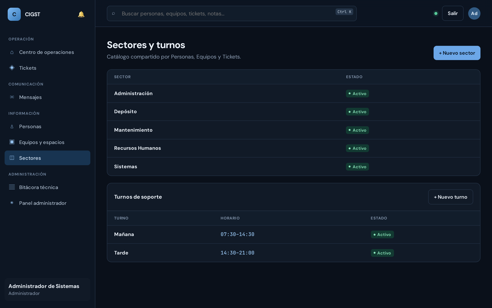
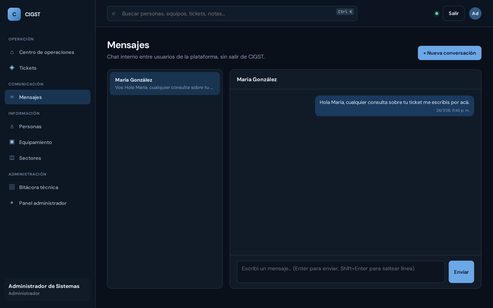
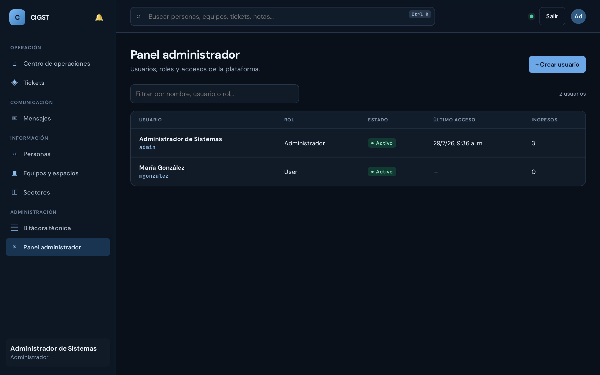

<div align="center">

# CIGST
### Centro Integral de Gestión de Soporte Técnico

**Tickets con adjuntos · Categorías por sector · Personas · Equipos y espacios · Chat interno · Notificaciones**

Todo en un solo lugar, corriendo **100% dentro de la red de la empresa** —
sin depender de internet ni de ningún servicio externo, en ningún momento.

[](docker-compose.yml)
[](backend/Dockerfile)
[](docker-compose.yml)
[](backend/tsconfig.json)
[](docs/seguridad.md)
[](docs/seguridad.md)
[](#)

</div>

<br>

<p align="center">
  
</p>

<br>

## ¿Qué es CIGST?

CIGST es la plataforma interna de pedidos de la empresa: reemplaza la
planilla, el grupo de chat externo y las hojas sueltas por un único sistema
donde cualquier persona pide ayuda, el área correspondiente la resuelve, y
todo queda registrado — quién pidió qué, quién lo atendió, sobre qué equipo
o espacio, y cuándo.

No es solo para Sistemas: **cada sector que recibe pedidos define sus
propias categorías**. Sistemas puede tener "Hardware" y "Red";
Mantenimiento, "Arreglar" y "Modificación"; y así con cada área. El
formulario de ticket se adapta solo al sector elegido.

Se instala con un solo comando, en una sola máquina de la red interna, y el
resto de la empresa accede desde el navegador de siempre. **Nunca sale un
byte a internet en el uso diario** — ver [Seguridad](docs/seguridad.md) para
el detalle completo de esa garantía.

## Por qué existe

| Sin CIGST | Con CIGST |
| --- | --- |
| Pedidos de soporte por chat/mail, se pierden entre mensajes | Un ticket por pedido, con estado, prioridad e historial |
| Cada área improvisa cómo clasificar sus pedidos | Cada sector define sus propias categorías de ticket |
| Las capturas del problema van por otro canal | Imágenes, PDF y planillas adjuntos al ticket o al chat |
| Nadie sabe qué equipo o espacio tiene cada sector | Inventario por sector, con historial automático de cada edición |
| El acceso a la info depende de quién pregunte primero | Permisos por rol, los mismos para todos, validados en el servidor |
| Coordinación por WhatsApp/email externo | Chat interno (1 a 1 y grupos) sin salir de la red de la empresa |
| Nadie se entera de un cambio salvo que lo busque | Notificaciones dentro de la plataforma, con un click al destino |

## Funciones principales

- 🎫 **Tickets** — alta en segundos (todo por listas desplegables), estado,
  prioridad, responsable asignado y solución aplicada. Menú de acciones
  rápidas para resolver/cerrar/asignarse sin abrir el detalle.
- 🏷️ **Categorías por sector** — cada área que recibe pedidos define las
  suyas ("Hardware" o "Red" para Sistemas; "Arreglar" o "Modificación" para
  Mantenimiento). Al elegir el sector en un ticket, la lista de categorías
  se ajusta sola a ese sector.
- 📎 **Archivos adjuntos** — imágenes, PDF y planillas en tickets y en el
  chat. Las imágenes se ven directamente; el resto se descarga. Hasta 5
  archivos de 10 MB por vez.
- 👤 **Personas** — ficha por colaborador con su sector, contacto, horario y
  tickets. Cada edición queda en un historial de cambios automático.
- 🏢 **Equipos y espacios** — no solo inventario informático: también
  consultorios, salas, puertas o instalaciones — cualquier cosa sobre la
  que se pida ayuda. Editable, con **historial de cambios automático** (qué
  cambió, de qué valor a qué valor, cuándo).
- 🗂️ **Sectores y turnos** — catálogo compartido por Personas, Equipos y
  Tickets; los turnos de soporte se configuran una vez por empresa.
- 💬 **Chat interno** — mensajería 1 a 1 y grupos (los crea un
  Administrador), 100% tráfico local, con badge de no leídos y adjuntos.
- 🔔 **Notificaciones** — campanita con lo que te corresponde a vos: ticket
  nuevo, cambio de estado, asignación, alta en un grupo. Un click te lleva
  al lugar exacto.
- 🔐 **Permisos por rol** — Administrador, Supervisor y User, cada uno con
  exactamente el acceso que le corresponde (tabla completa en
  [seguridad.md](docs/seguridad.md)).
- 📋 **Bitácora técnica** — registro de eventos de infraestructura, para
  Administradores.

<details>
<summary><strong>Ver más capturas de pantalla</strong></summary>
<br>

| | |
|---|---|
|  |  |
|  |  |

</details>

## Instalación en 3 pasos

1. **Descargar el proyecto** (clonar el repositorio o bajar el ZIP y
   descomprimirlo).
2. **Ejecutar el instalador**:
   - 🪟 **Windows**: doble click en `install.bat`
   - 🐧 **Linux** / 🍎 **Mac**: en una terminal, `./install.sh`
3. **Elegir la opción 1** del menú y responder las preguntas (o apretar
   Enter para usar valores seguros por defecto). Al terminar, el instalador
   muestra la dirección para entrar, por ejemplo: `http://localhost:3000`

El mismo menú sirve después para el día a día:

```
   1) Instalar / iniciar / actualizar la plataforma
   2) Ver estado de los servicios
   3) Ver logs en vivo
   4) Reiniciar servicios
   5) Detener la plataforma
   6) Hacer copia de seguridad (datos + adjuntos)
   7) Restaurar una copia de seguridad
   8) Resetear todo (BORRA los datos)
   9) Salir
```

## Actualizar sin perder datos

> [!IMPORTANT]
> **Actualizar la plataforma NO borra nada.** Los datos viven en volúmenes de
> Docker independientes del código: al actualizar se reemplaza la aplicación,
> no la información. Tickets, personas, equipos, sectores, usuarios, chats,
> notificaciones y archivos adjuntos siguen exactamente donde estaban.

Para actualizar a una versión nueva:

1. **(Recomendado)** Opción **6** del menú → copia de seguridad. Queda en
   `backups/AAAA-MM-DD_HH-MM/` con la base completa, los adjuntos y una
   copia del `.env`. Guardala fuera de esa máquina.
2. Traer el código nuevo: `git pull` (o descargar el ZIP nuevo y reemplazar
   los archivos — **menos** tu `.env`, que es tuyo y nunca viene en el ZIP).
3. Opción **1** del menú. Reconstruye la aplicación, aplica las migraciones
   de base de datos que falten sobre los datos existentes, y la deja andando.

Lo único que borra datos es la opción **8 (Resetear)**, que además exige
escribir `BORRAR` para confirmar.

<details>
<summary><strong>Cómo se verificó esto</strong></summary>
<br>

Se instaló una versión anterior, se cargaron datos como los de una empresa
(5 sectores, 4 personas, 3 equipos, 5 tickets, 3 usuarios, bitácora y
mensajes de chat), y se actualizó a la versión actual con la opción 1. Tras
la actualización: **los mismos 5 sectores, 4 personas, 3 equipos, 5 tickets,
3 usuarios, bitácora y mensajes**, con las tablas nuevas creadas y vacías,
listas para usar.

También se probó el ciclo completo de respaldo: copia → borrado total de la
plataforma → restauración → los datos volvieron completos y la plataforma
siguió funcionando.

</details>

> **¿Qué hace exactamente el instalador, y por qué hace falta uno?**
> Respuesta completa, paso a paso, en [docs/instaladores.md](docs/instaladores.md).

## Requisitos

> [!IMPORTANT]
> Lo **único** que hay que instalar a mano, en cualquier sistema operativo,
> es **Docker** — es la única pieza que este proyecto no puede automatizar
> de forma segura (instalarla requiere permisos de administrador y,
> normalmente, un reinicio del equipo). Todo lo demás lo hace el instalador.

| Sistema | Qué instalar | Notas |
| --- | --- | --- |
| 🪟 Windows 10/11 (64 bits) | [Docker Desktop](https://www.docker.com/products/docker-desktop) | Requiere WSL2 y virtualización activa en la BIOS/UEFI (el instalador de Docker guía ambos pasos). |
| 🍎 macOS | [Docker Desktop](https://www.docker.com/products/docker-desktop) | — |
| 🐧 Linux | Docker Engine | El instalador de CIGST puede instalarlo por vos (con tu confirmación explícita), o hacerlo a mano con la [guía oficial](https://docs.docker.com/engine/install/). |

**No hace falta instalar Node.js, PostgreSQL, ni ninguna otra dependencia.**
Todo el software de la plataforma corre encapsulado dentro de contenedores
Docker — nada se instala en el sistema operativo más allá de Docker mismo.
Internet solo se usa una vez, durante la construcción inicial, para
descargar esas piezas (todas de fuentes oficiales: Docker Hub y el
registro oficial de npm — detalle en [seguridad.md](docs/seguridad.md));
después, el uso diario es 100% interno a la red de la empresa.

## Primer ingreso

- Usuario: `admin`
- Contraseña: la que elegiste durante la instalación (o la generada
  automáticamente de 20 caracteres, guardada en el archivo `.env` de esta
  carpeta — ver [`.env.example`](.env.example) para el detalle de cada
  variable).

La plataforma arranca con un caso de ejemplo cargado (una persona, un
equipo, un ticket y una conversación de chat) para probar el circuito
completo enseguida.

## Seguridad, en breve

- Sesiones server-side (cookie `httpOnly`, `SameSite=Strict`); nunca se
  guarda una contraseña ni un token de sesión en texto plano.
- Permisos por rol validados **en el servidor**, no solo ocultos en la
  interfaz.
- Cero llamadas a servicios externos en tiempo de ejecución (verificado con
  captura de tráfico de red).
- Contenedores reforzados: sin privilegios nuevos, backend con sistema de
  archivos de solo lectura, base de datos sin puerto expuesto al host.
- `npm audit`: 0 vulnerabilidades conocidas. Todas las dependencias son de
  fuentes oficiales, con versiones fijadas.

Detalle completo, con la matriz de permisos por rol y la privacidad del
chat explicada punto por punto: **[docs/seguridad.md](docs/seguridad.md)**.

## Problemas comunes

| Síntoma | Qué hacer |
| --- | --- |
| Docker Desktop no arranca (Windows) | Verificar que la virtualización esté activada en la BIOS/UEFI y que WSL2 esté habilitado. |
| `docker: permission denied` (Linux) | Cerrar sesión y volver a entrar después de instalar Docker (tu usuario entra al grupo `docker` recién ahí). |
| "El puerto ya está ocupado" | Editar `APP_PORT` en el archivo `.env` (por ejemplo `3001`) y volver a la opción 1 del menú. |
| La interfaz se ve rota/desordenada justo después de actualizar la plataforma | Forzar recarga sin caché (`Ctrl+Shift+R`). No debería repetirse: el servidor ya obliga a revalidar los archivos en cada visita. |
| Cualquier otro error del instalador | El detalle técnico completo queda en `install.log`, en esta misma carpeta. |

## Documentación

| Documento | Para quién |
| --- | --- |
| 📘 **[Manual de uso](docs/guia-usuario.md)** ([PDF](docs/Manual-de-uso-CIGST.pdf)) | Cualquier persona — cómo se usa la plataforma día a día, con capturas. |
| ⬇️ **[Cómo descargar la plataforma](docs/Como-descargar-CIGST.pdf)** (PDF) | Quien va a instalarla — Windows y Linux, paso a paso. |
| ⚙️ **[Cómo instalar la plataforma](docs/Como-instalar-CIGST.pdf)** (PDF) | Quien va a instalarla — máximo detalle, Windows y Linux. |
| 🔧 **[Instaladores: análisis técnico](docs/instaladores.md)** | Quien prueba/audita `install.sh`/`install.ps1`. |
| 🏗️ **[Arquitectura](docs/arquitectura.md)** | Desarrolladores — stack, estructura del código, decisiones de diseño. |
| 🗄️ **[Modelo de datos](docs/base-de-datos.md)** | Desarrolladores — entidades, convenciones, migraciones. |
| 🔐 **[Seguridad](docs/seguridad.md)** | Cualquiera evaluando si confiar en la plataforma. |

---

<div align="center">

Software interno — no distribuido públicamente.

</div>
