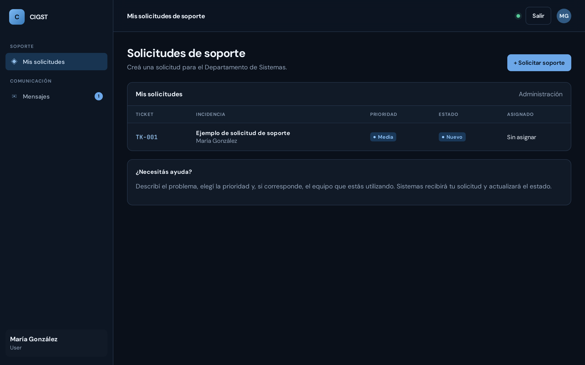

# CIGST — Guía de usuario

*Esta guía explica cómo se usa la plataforma en el día a día, sin
tecnicismos. También está disponible en [PDF](Guia-de-usuario-CIGST.pdf)
para imprimir o compartir.*

---

## ¿Qué es CIGST?

CIGST es la plataforma interna de soporte técnico de la empresa. Sirve para
que cualquier persona pida ayuda cuando algo no funciona (la computadora, la
impresora, un sistema, una contraseña) y para que el equipo de soporte
organice, resuelva y deje registro de cada pedido.

Todo queda en un solo lugar: los pedidos ("tickets"), las personas, los
equipos de la empresa, y un chat interno para comunicarse sin salir de la
plataforma. **Funciona solo dentro de la red de la empresa**: nada de lo que
se carga sale a internet.

---

## Cómo se instala (una sola vez, en un solo equipo)

La instalación la hace una sola persona, en la máquina que va a funcionar
como servidor. Solo hace falta tener Docker instalado (en Windows: Docker
Desktop).

1. Descargar la carpeta del proyecto.
2. **Windows**: doble click en `install.bat` — **Linux/Mac**: ejecutar
   `./install.sh`
3. Elegir la opción **1** del menú y responder las preguntas (o apretar
   Enter para usar valores seguros por defecto).

Al terminar, el instalador muestra la dirección para entrar (por ejemplo
`http://servidor:3000`). El resto del personal solo necesita esa dirección
y su navegador de siempre: no instala nada.

---

## Entrar a la plataforma

1. Abrí el navegador (Chrome, Edge, Firefox) y escribí la dirección que te
   pasó Sistemas — por ejemplo `http://servidor:3000`.
2. Ingresá tu usuario y contraseña y tocá **Iniciar sesión**.

> ¿Olvidaste tu contraseña? Pedile a un Administrador que te asigne una
> nueva desde el Panel administrador. No hace falta crear cuentas nuevas.

---

## Los tres tipos de usuario

| Tipo | Qué puede hacer |
| --- | --- |
| **User** | Pedir soporte para sí mismo y seguir el estado de sus propias solicitudes. Es el perfil de la mayoría. |
| **Supervisor** | Ver y gestionar los tickets de **toda** la empresa, crear tickets para cualquier persona, y administrar personas, equipos, sectores y turnos. |
| **Administrador** | Todo lo anterior, más la bitácora técnica y el panel de usuarios (crear cuentas, cambiar contraseñas, dar de baja). |

Todos los perfiles pueden usar el **chat interno**.

La plataforma se adapta sola: cada persona ve únicamente las secciones que
le corresponden.

---

## El Centro de operaciones

Es la pantalla principal del equipo de soporte: cuántos tickets hay
abiertos, cuáles son urgentes, cuáles están en proceso y qué pasó
últimamente.

---

## Pedir soporte (crear un ticket)

**Si sos User**: al entrar ves "Mis solicitudes". Tocá **+ Solicitar
soporte**, contá brevemente qué pasa, elegí la prioridad y, si corresponde,
el equipo con el que estás trabajando. Listo — Sistemas recibe tu pedido al
instante.

**Si sos Supervisor o Administrador**: desde **Tickets → + Nuevo ticket**
podés crear un pedido para cualquier persona de la empresa. Casi todo se
elige de listas desplegables — la idea es que crear un ticket lleve
segundos.

La fecha y hora del pedido se registran solas: no hay que escribirlas.

### Seguir y resolver tickets

- Tocando un ticket de la lista se abre su detalle: ahí el equipo de
  soporte cambia el estado (Nuevo, En proceso, Resuelto…), asigna un
  responsable y anota la solución aplicada.
- Para lo rápido, el menú de tres puntos (⋮) al final de cada fila permite
  **marcar como Resuelto**, **Cerrar** o **Asignarme** el ticket sin abrir
  nada.

---

## Personas y Equipamiento

En **Personas** está la ficha de cada colaborador: sector, contacto,
horario, y los tickets que pidió. En **Equipamiento**, cada equipo de la
empresa (computadoras, impresoras, teléfonos…) con su sector y estado.
Ambas se cargan y editan desde la propia pantalla, con formularios simples.

---

## Sectores y turnos

En **Sectores** se administran las áreas de la empresa (Administración,
Sistemas, Depósito…). Entrando a un sector se ve qué personas y qué equipos
tiene. En la misma pantalla se definen los **turnos de soporte** (por
ejemplo "Mañana 07:30–14:30"), que después aparecen como opción al crear un
ticket. Cada empresa configura los suyos.

---

## Mensajes (chat interno)

En **Mensajes** podés chatear con cualquier persona que use la plataforma,
del perfil que sea. A la izquierda están tus conversaciones (con un
indicador de mensajes sin leer); a la derecha, la conversación abierta.
**+ Nueva conversación** muestra la lista de personas para elegir a quién
escribirle.

- Enter envía el mensaje; Shift+Enter baja de línea.
- El numerito azul en "Mensajes" avisa cuántos mensajes sin leer tenés.
- **Privacidad**: cada conversación la ven solo las dos personas que
  participan. Nadie más — ni siquiera un Administrador — puede leerla.

---

## Panel administrador (solo Administradores)

Desde acá se crean las cuentas de usuario, se elige el perfil de cada una
(Administrador, Supervisor o User), se cambian contraseñas, se desactivan
cuentas y, si hace falta, se eliminan definitivamente.

> La plataforma no permite quedarse sin ningún Administrador activo ni que
> un Administrador se borre a sí mismo — para no quedar nunca afuera.

---

## Bitácora técnica (solo Administradores)

Un registro de eventos técnicos importantes (mantenimientos, cambios de
infraestructura, incidentes de seguridad) que queda como historial de la
empresa.

---

## Preguntas frecuentes

**No veo alguna de las secciones que menciona esta guía.**
Es normal: cada perfil ve solo lo que le corresponde. Si creés que te falta
acceso, hablá con un Administrador.

**¿Se pierde algo si se apaga el servidor?**
No. Los datos quedan guardados y reaparecen al volver a encender la
plataforma (opción 1 del instalador).

**¿Quién puede leer mis chats?**
Solo vos y la otra persona de la conversación. Nadie más.

**¿La información sale a internet?**
No. La plataforma funciona completamente dentro de la red de la empresa.
