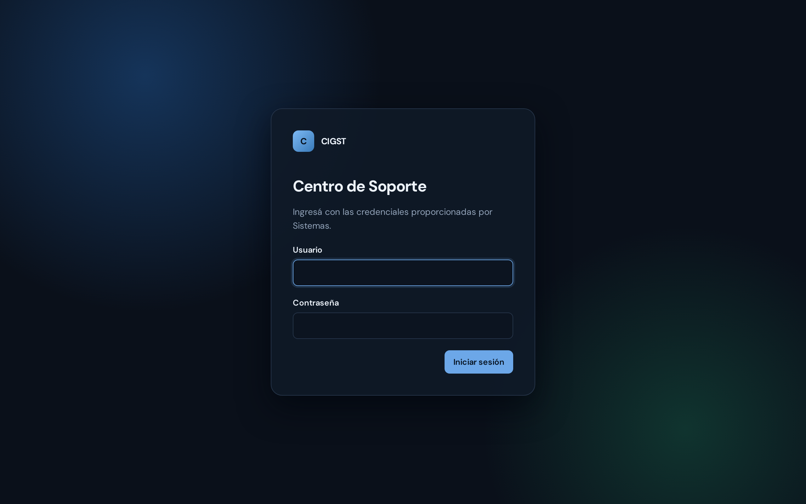
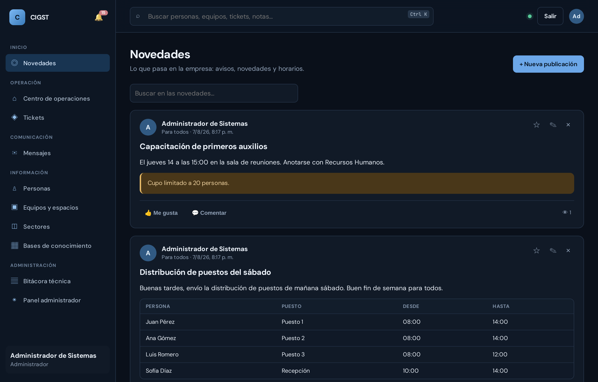
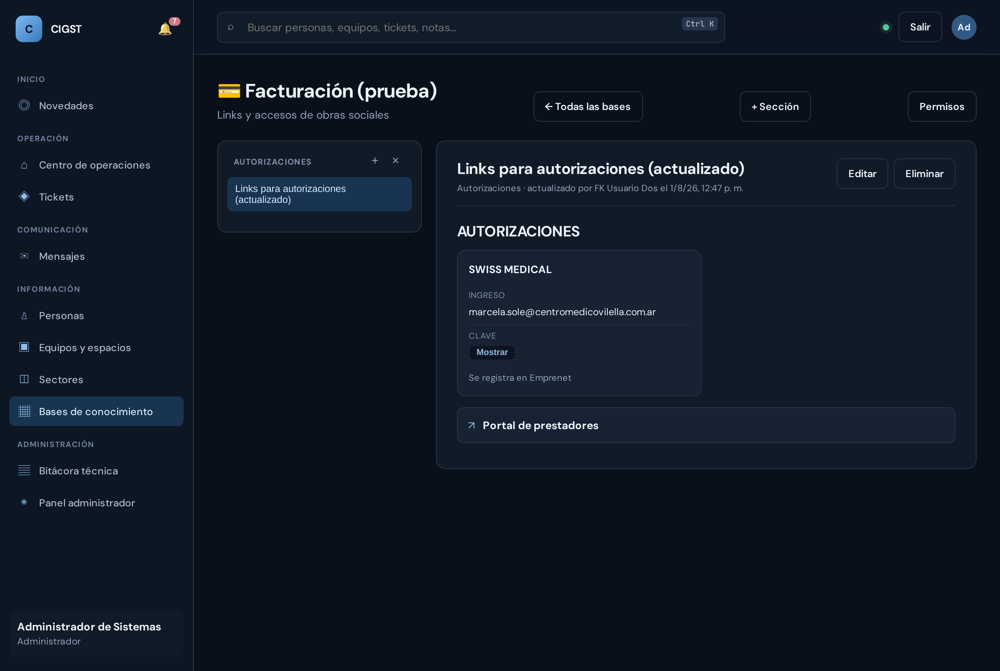
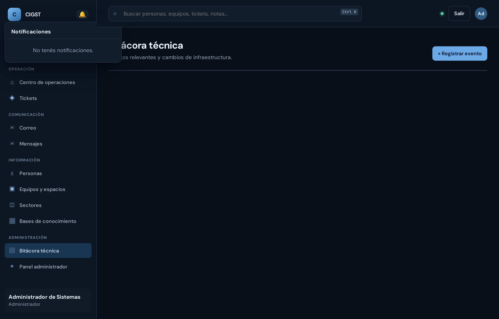
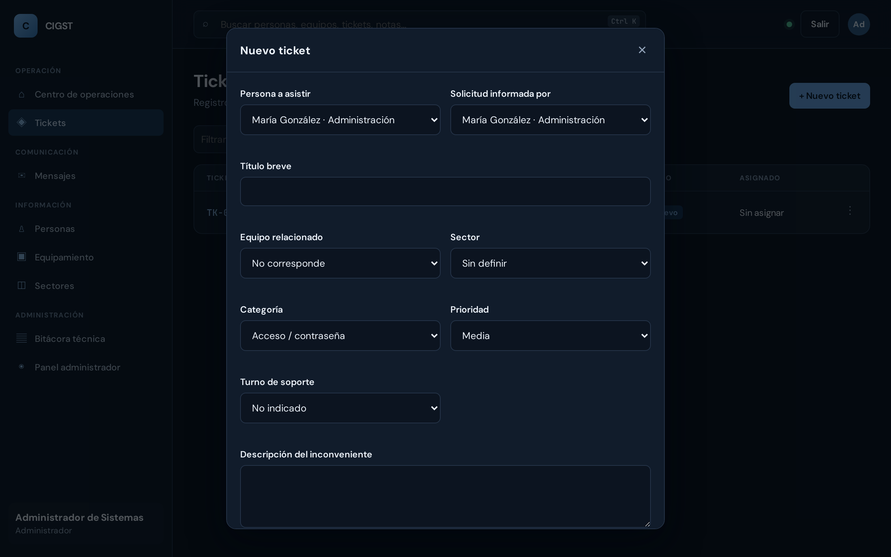
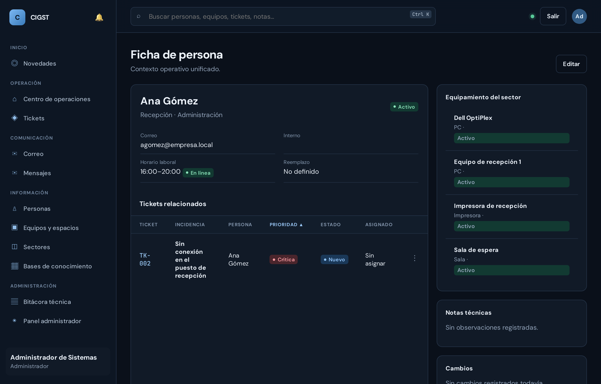

# CIGST — Manual de uso

*Cómo se usa la plataforma en el día a día, sin tecnicismos. La versión
completa con capturas está en [PDF](Manual-de-uso-CIGST.pdf) para imprimir o
compartir. Si todavía no la instalaste, ver antes
[Cómo descargar](Como-descargar-CIGST.pdf) y [Cómo instalar](Como-instalar-CIGST.pdf).*

---

## ¿Qué es CIGST?

CIGST es la plataforma interna de soporte técnico de la empresa: tickets,
personas, equipos, sectores, chat interno con grupos y notificaciones — todo
en un solo lugar. **Funciona solo dentro de la red de la empresa**: nada de
lo que se carga sale a internet.

---

## Cómo se instala (una sola vez, en un solo equipo)

1. Descargar la carpeta del proyecto.
2. **Windows**: doble click en `install.bat` — **Linux/Mac**: `./install.sh`
3. Elegir la opción **1** del menú y responder las preguntas (o Enter para
   valores seguros por defecto).

Al terminar, el instalador muestra la dirección para entrar (por ejemplo
`http://servidor:3000`). El resto del personal solo necesita esa dirección y
su navegador: no instala nada.

---

## Entrar a la plataforma

Abrí el navegador, escribí la dirección que te pasó Sistemas, y entrá con tu
usuario y contraseña. ¿La olvidaste? Un Administrador te asigna una nueva
desde el Panel administrador.

---

## Los tres rangos y sus permisos

| Rango | Qué puede hacer |
| --- | --- |
| **Administrador** | Todo: crea y edita personas, usuarios, equipos, sectores y turnos (cada edición deja registro de cambios), gestiona tickets, usa el chat, crea los grupos, publica en Novedades, crea bases de conocimiento y define sus permisos. Es el único que ve Bitácora técnica y Panel administrador. |
| **Supervisor** | Ve todo el trabajo de soporte y lo opera: crea y gestiona tickets de cualquiera. **Publica en Novedades** (y administra lo suyo). Ve personas, equipos y sectores con sus historiales, pero **no puede crear ni editar** esos catálogos. No ve Bitácora ni Panel administrador. |
| **User** | Crea tickets para sí mismo o para cualquier persona (con adjuntos) y ve solo sus propias solicitudes. Usa el chat (1 a 1 y los grupos donde lo agregaron). **Lee Novedades y comenta**, pero no publica. Entra a las **bases de conocimiento a las que le dieron permiso**. |

Los permisos se controlan en el servidor: lo que tu rango no permite, la
plataforma lo rechaza aunque se intente por otra vía.

---

## Ordenar y buscar en cualquier lista

Esto vale para **todas** las listas de la plataforma: Tickets, Personas,
Equipos y espacios, Sectores, Turnos y el Panel administrador.

- **Ordenar**: hacé clic en el título de una columna y la lista se ordena por
  ella; un segundo clic la invierte. La flecha ▲ / ▼ muestra por cuál está
  ordenada y en qué sentido.
- **Buscar**: el casillero de arriba filtra a medida que escribís, y el orden
  que elegiste se mantiene.

El orden alfabético es **el que uno espera**, no el de la computadora: no
distingue mayúsculas de minúsculas, ubica los acentos y la ñ donde
corresponde en castellano ("Ávila" va junto a "Ana", no al final), y compara
los números por valor — *Consultorio 3* antes que *Consultorio 213*.

Dos columnas se ordenan por su propio criterio en vez del abecedario, porque
es lo útil: **Prioridad** va de Crítica a Baja, y **Estado** sigue el avance
del ticket (Nuevo → … → Cerrado).

**Los desplegables de los formularios** también vienen ordenados
alfabéticamente con el mismo criterio, así no hay que buscar a alguien en
una lista desordenada.

---

## Novedades: el tablero de la empresa

Es la pantalla con la que se entra. Ahí aparecen los avisos, las novedades y
los horarios: quién cubre cada puesto el sábado, un cambio de proveedor, una
capacitación.

**Publican Administradores y Supervisores. Lee todo el personal.**

### Escribir una publicación

**+ Nueva publicación** → título, para quién es, y el contenido. El contenido
se arma con **bloques**, y se agregan los que hagan falta:

| Bloque | Para qué |
|---|---|
| **Texto** | Un párrafo común. |
| **Título** | Para separar partes largas. |
| **Tabla** | La grilla de puestos, un cuadro de guardias, cualquier planilla. |
| **Lista** | Puntos o pasos numerados. |
| **Imagen** | Una foto o una captura. |
| **Archivo** | Un PDF o una planilla para descargar. |
| **Aviso** | Un recuadro de color para lo importante. |
| **Enlace** | Un link a un sistema o a un portal. |
| **Tarjeta de datos** | Un bloque con datos etiquetados (más usado en las bases). |

> **La grilla del sábado, sin sufrir.** Agregá un bloque de **Tabla** y
> **pegá directamente desde Excel** en cualquier casillero: la tabla se
> completa sola, con la primera fila como encabezado. No hace falta cargar
> celda por celda ni mandar una captura de pantalla.

**Para quién es**: *Toda la empresa* o *Solo algunos sectores*. Si elegís
sectores, la publicación **no le aparece a nadie más** — ni en la lista ni
entrando por el enlace directo.

### Leer, comentar y reaccionar

Cualquier persona puede **comentar** y poner **👍 Me gusta** en lo que ve.
El **👁 con un número** dice cuántos la leyeron; tocándolo se ve quiénes.

Quien publicó (y un Administrador) puede **fijarla arriba** con la estrella
⭐, editarla o eliminarla. Las fijadas siempre quedan primeras.

Todo esto es **en tiempo real**: una publicación nueva, un comentario o un
"me gusta" aparecen solos, sin recargar.

---

## Bases de conocimiento

Acá vive lo que hoy está en un Excel que circula por mail o en un cuaderno:
los accesos a las obras sociales, cómo se hace un procedimiento, los
instructivos de cada área.

**Cada área arma la suya.** Adentro hay **secciones** (por ejemplo
*Autorizaciones* dentro de *Facturación*) y adentro de cada sección, los
**artículos**.

### Quién ve qué

Un Administrador crea la base y define los permisos desde el botón
**Permisos**. Se puede dar acceso a:

- un **sector** completo (todo Facturación),
- un **rango** (todos los Supervisores),
- una **persona** puntual.

Y en dos niveles: **solo lectura** o **lectura y edición**.

> Quien no tiene permiso **no ve la base**: no aparece en la lista, y entrando
> por el enlace directo la plataforma responde que no existe. No es que se
> oculte el botón — el servidor directamente no la entrega.

### Escribir un artículo

Se arma con los mismos bloques que el feed. El más usado acá es la
**Tarjeta de datos**: título, logo opcional y una lista de datos etiquetados.
Es lo que sirve para armar una tarjeta por obra social con su usuario, su
clave y su nota.

### Usuarios y contraseñas compartidas

Al cargar un dato en una tarjeta se lo puede marcar como **Ocultar**. Ese
valor se muestra tapado, con un botón **Mostrar**, y no aparece en los
resultados de la búsqueda.

> Sirve para que la clave de una prepaga no quede a la vista de cualquiera que
> pase por detrás de la pantalla. **No es una caja fuerte**: quien tiene
> permiso de lectura puede revelarla. La protección real es a quién le das
> acceso a la base.

### Buscar

El casillero de arriba busca por título **y dentro del contenido**, pero solo
en las bases que vos podés ver.

---

## El Centro de operaciones

La pantalla principal del equipo de soporte: tickets abiertos, urgentes, en
proceso y la actividad reciente. En **Actividad reciente**, el nombre de la
persona y el código del ticket son clickeables y llevan directo a la ficha o
al ticket.

---

## Notificaciones (la campanita)

Arriba a la izquierda, al lado del logo, está la campanita 🔔 con el número
de notificaciones sin leer. Tocando una notificación vas directo a lo que te
avisa (el ticket, el grupo…) y queda marcada como leída. Llegan avisos por:
ticket nuevo (al equipo de soporte), cambio de estado de tu ticket, ticket
asignado a vos, y alta en un grupo de chat.

---

## Tickets

**Crear** (cualquier rango): + Nuevo ticket / + Solicitar soporte → elegí a
la **persona a asistir** (vos u otra persona), título breve, descripción, y
si corresponde el **equipo o espacio**.

Aparte va el **Sector a requerir**: a qué área le estás pidiendo la ayuda.
Es una decisión tuya y arranca vacío a propósito — **no** se deduce de dónde
está ubicada la persona ni el equipo. Alguien de Administración puede
pedirle a Mantenimiento por una PC que está en Depósito, y las tres cosas
son distintas. La **categoría** se arma con las que definió ese sector: si
cambiás el sector, cambia la lista. La fecha y hora se registran solas.

También podés **adjuntar archivos** (imágenes, PDF o planillas): hasta 5 por
ticket, de 10 MB cada uno. Es la forma más rápida de mostrar el problema —
una captura de pantalla vale más que tres párrafos de descripción.

> **Las fotos se achican solas.** Una foto de celular pesa entre 3 y 6 MB, y
> para ver una impresora rota no hace falta ni la décima parte. Al elegirla, el
> navegador la reduce antes de mandarla: ocupa unas **10 veces menos** en el
> servidor, se sube más rápido y se ve igual. Los PDF y las planillas no se
> tocan. Si la foto era muy pesada vas a ver un aviso diciendo cuánto bajó.

**Seguir y resolver** (Administrador y Supervisor): el detalle permite
cambiar estado, asignar responsable y anotar la solución; el menú ⋮ de cada
fila resuelve/cierra/asigna sin abrir nada. El ticket siempre muestra los
datos **actuales** del equipo involucrado, aunque haya cambiado después.

**Ocultar los cerrados.** Arriba de la lista hay un selector de estado que
arranca en **«Sin cerrados ni cancelados»**: en el día a día lo que importa
es lo que sigue abierto. Al lado se ve el conteo ("5 de 7") para saber
cuántos se están ocultando. Las otras opciones son *Todos los estados*,
*Solo cerrados* y cada estado por separado.

---

## Personas

La ficha de cada colaborador: sector, contacto, horario, tickets y el
equipamiento de su sector (clickeable). **Crear y editar es del
Administrador**; cada edición deja una línea automática en el panel
**Cambios** de la ficha ("de X a Y", con fecha y hora).

### Horario laboral y disponibilidad

En la ficha se cargan **hora de entrada** y **hora de salida** eligiéndolas
de un reloj — no hay que escribir el horario a mano. Con eso la plataforma
muestra sola, en la lista y en la ficha, si la persona está:

| | |
|---|---|
| **En línea** | La hora actual cae dentro de su horario. |
| **Fuera de horario** | Tiene horario cargado, pero ahora no está. |
| **Sin horario** | Todavía no se le cargó ninguno. |

El cálculo lo hace el **servidor**, no la computadora de cada uno: todos ven
el mismo estado aunque tengan el reloj desajustado. Los **turnos que cruzan
la medianoche** funcionan igual (22:00 a 06:00 marca *en línea* a las 2 de
la mañana). Para dejar de mostrar disponibilidad, se borran las dos horas.

### Eliminar una persona

El botón **Eliminar** está dentro de *Editar* (solo Administrador). Los
**tickets que esa persona pidió no se borran**: siguen en la lista con su
nombre, para que no se pierda el historial.

---

## Equipos y espacios

No es solo inventario informático: acá va **cualquier cosa sobre la que se
pueda pedir ayuda**. Una PC o una impresora, sí — pero también un
**consultorio**, una **sala**, una **oficina**, una **puerta** o una
**instalación**. Por eso el tipo incluye tanto equipos como espacios, y el
nombre puede ser un modelo ("Dell OptiPlex") o una identificación de lugar
("Consultorio 213").

La idea **no** es cargar cada objeto de la empresa: solo lo que
efectivamente recibe pedidos. Si el pedido es "arreglar la puerta del
consultorio 213", alcanza con tener cargado ese consultorio y describir el
arreglo en la descripción del ticket.

Cada uno **vive en un sector**, que dice dónde está ubicado. Ojo: eso es
independiente del *sector a requerir* de un ticket — que una impresora esté
en Depósito no significa que el arreglo se le pida a Depósito.

**Editar es del Administrador**: cada cambio de nombre, sector o estado
queda registrado automáticamente en el panel **Cambios**, con el valor
anterior y el nuevo. No conviene crear uno nuevo al reemplazar un equipo: se
edita el existente y el historial guarda lo que había antes. El botón
**Eliminar** está dentro de *Editar*; los tickets asociados no se borran.

---

## Sectores, turnos y categorías

Las áreas de la empresa. El detalle de un sector muestra:

- Sus **personas** y sus **equipos y espacios** (clickeables, útil cuando
  dos se llaman igual en sectores distintos).
- Sus **categorías de ticket**: las que van a aparecer al crear un ticket
  dirigido a ese sector. Un Administrador las agrega y elimina desde ahí
  mismo. Ejemplo: Sistemas puede tener "Hardware", "Red / conectividad";
  Mantenimiento, "Arreglar", "Modificación"; y cada área las suyas.

Con **+ Agregar persona a este sector** se da de alta a alguien sin salir de
la pantalla: el sector viene precargado y al guardar seguís donde estabas.

Al eliminar una categoría, los tickets que ya la usaron **no se modifican**
— simplemente deja de ofrecerse para tickets nuevos.

**Eliminar un sector** se hace desde *Editar*. Si todavía tiene gente o
equipos adentro, la plataforma no lo borra y avisa cuántos hay: primero se
los mueve a otro sector (o se los deja sin sector) y recién ahí se elimina.
Es a propósito — si no, esas fichas quedarían señalando un sector que ya no
existe.

En la misma pantalla se definen los turnos de soporte. Todo esto lo
administra el Administrador; el Supervisor lo ve.

---

## Mensajes: chat 1 a 1 y grupos

Chateá con cualquier persona de la plataforma. Los **grupos aparecen siempre
primeros** en la lista, con su etiqueta. Enter envía, Shift+Enter baja de
línea, y el badge azul avisa los mensajes sin leer.

Los mensajes llegan **al instante**: no hay que recargar ni esperar. Lo mismo
con los cambios de estado de los tickets y con la campanita. Si se corta el
wifi o se suspende la computadora, al volver se reconecta sola y se pone al
día con lo que pasó mientras tanto — no hay que hacer nada.

El botón 📎 permite **adjuntar archivos** (imágenes, PDF, planillas). Las
imágenes se ven directamente en la conversación; el resto aparece como una
tarjeta para descargar. Se puede mandar un archivo sin escribir nada.

- **Grupos**: los crea el Administrador (+ Nuevo grupo), elige integrantes de
  cualquier rango (cada uno recibe una notificación), y puede editarlos o
  eliminarlos. Al elegir integrantes, **al lado de cada nombre aparece su
  sector** — así no se confunden dos personas que se llaman parecido — y la
  lista viene ordenada alfabéticamente. Todos los integrantes leen y
  escriben; cada mensaje muestra quién lo mandó.
- **Privacidad**: una conversación la ven solo sus participantes y un grupo
  solo sus integrantes. Nadie más — ni siquiera un Administrador que no sea
  parte.

---

## Panel administrador (solo Administradores)

Cuentas de usuario: crear, cambiar rango o contraseña, desactivar o eliminar.
Cada modificación deja su línea en el historial **"Cambios de esta cuenta"**.
La plataforma no permite quedarse sin ningún Administrador activo.

---

## Preguntas frecuentes

**No veo alguna sección de este manual.** Es normal: cada rango ve solo lo
suyo. Si creés que te falta acceso, hablá con un Administrador.

**¿Cómo sé si mi pedido avanzó?** Te llega una notificación cada vez que tu
ticket cambia de estado, y lo ves en "Mis solicitudes".

**Cerré la notebook y al abrirla el chat parecía congelado.** Se reconecta
sola en unos segundos y trae lo que llegó mientras tanto. Si tenés dudas,
recargar la página no rompe nada.

**¿Se pierde algo si se apaga el servidor?** No: los datos quedan guardados.

**¿Quién puede leer mis chats?** Solo los participantes.

**¿La información sale a internet?** No, nunca.

**Pegué una tabla de Excel y no se armó.** Tiene que ser un bloque de
**Tabla**, y hay que pegar adentro de un casillero de esa tabla. Si copiaste
una sola celda, se pega como texto normal (es lo esperado).

**No veo una base de conocimiento que sí existe.** No te dieron permiso. Un
Administrador te lo da desde *Bases de conocimiento → la base → Permisos*.

**Publiqué para un sector y alguien de otro sector la vio.** Los
Administradores ven todo el feed a propósito, para poder auditar lo que se
publica. Fuera de eso, nadie más la ve.

**Aparece "En línea" alguien que no está.** El estado sale del **horario
cargado en su ficha**, no de si tiene la plataforma abierta: dice que está
dentro de su franja laboral. Si el horario cambió, se corrige en la ficha.

**Al crear un ticket el Sector aparece vacío.** Es a propósito: el *Sector a
requerir* es a quién le pedís la ayuda, y eso lo elegís vos. No se deduce de
dónde está la persona ni el equipo.

**El desplegable de Categoría dice "Elegí primero el sector a requerir".**
Las categorías las define cada sector, así que primero se elige el sector.
Si dice "Este sector no tiene categorías cargadas", un Administrador puede
agregárselas desde Sectores → el sector → *Categorías de ticket*.

**No me deja borrar un sector.** Tiene personas o equipos adentro; el aviso
dice cuántos. Movelos a otro sector (o dejalos sin sector, eligiendo "Sin
definir" en su ficha) y después sí se elimina.

**Borré una persona: ¿se fueron sus tickets?** No. Los tickets quedan con su
nombre para no perder el historial.

**No encuentro el botón Eliminar.** Está adentro de **Editar**, y solo lo ve
un Administrador. Tu propia cuenta de usuario no ofrece eliminarse.
