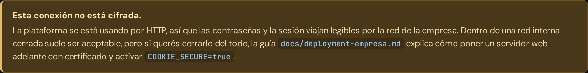

# Seguridad

> Este documento explica **cómo** está protegida la plataforma. Si lo que
> buscás es **la prueba** de que esas protecciones funcionan, está en
> [auditoria-seguridad.md](auditoria-seguridad.md): 108 controles ejecutados
> contra la plataforma corriendo.

## Autenticación y sesiones

- Contraseñas con hash **bcrypt** (12 rondas), nunca en texto plano.
- Sesiones server-side: el navegador guarda solo un token opaco aleatorio en
  una cookie `httpOnly` + `SameSite=Strict`; la base guarda únicamente el
  **hash SHA-256** de ese token. Robar la base no permite fabricar sesiones.
- Expiración deslizante (por defecto 12 h, configurable con
  `SESSION_TTL_HOURS`). Cerrar sesión elimina la sesión de verdad.
- **Política de contraseñas**: mínimo 10 caracteres, combinando al menos tres
  de los cuatro tipos (minúsculas, mayúsculas, números, símbolos), sin
  secuencias tipo `1234` o `abcd`, sin el mismo carácter cuatro veces seguidas,
  sin las contraseñas más usadas del mundo y sin contener el nombre de usuario.
  Se piden tres de cuatro familias y no las cuatro a propósito: una frase
  memorable con un número y un guion cumple de sobra, y una persona que no
  puede cumplir la regla termina eligiendo la contraseña más fácil que el
  sistema le acepte, que es peor que no tener política.
- **Freno de fuerza bruta en la base de datos**: 8 contraseñas erradas bloquean
  esa cuenta durante 15 minutos, venga el intento de donde venga; 30 fallos
  desde una misma dirección de red la bloquean por el mismo lapso. Vive en la
  base y no en memoria porque el limitador anterior era del proceso: alcanzaba
  con **reiniciar el contenedor** para poner los contadores a cero.
- Un límite general de contención en el resto de la API (ver "Límites de uso").
- **CSRF**: no hay tokens anti-CSRF explícitos porque no hacen falta con
  este diseño — la cookie de sesión es `SameSite=Strict`, así que el
  navegador directamente **no la envía** en un pedido originado desde otro
  sitio (ni siquiera en una navegación de nivel superior, a diferencia de
  `Lax`). Sin la cookie, un formulario o script malicioso en otra página no
  tiene forma de autenticarse contra la API de CIGST.

## Permisos (RBAC)

Tres roles, validados **en el backend en cada endpoint** — lo que la
interfaz oculta también está bloqueado en la API (devuelve `403`):

| | Administrador | Supervisor | User |
| --- | :-: | :-: | :-: |
| Crear/gestionar tickets (de cualquiera) | ✅ | ✅ | solo crear; ve únicamente los propios |
| Ver Personas / Equipamiento / Sectores y Turnos | ✅ | ✅ (solo lectura) | ❌ (solo un directorio mínimo vía `/tickets/form-options` para armar su ticket) |
| Crear/editar/borrar Personas, Equipos, Sectores, Turnos | ✅ (con log de cambios) | ❌ | ❌ |
| Bitácora técnica | ✅ | ❌ | ❌ |
| Panel administrador (usuarios) | ✅ | ❌ | ❌ |
| Chat interno (1 a 1 y grupos donde es miembro) | ✅ | ✅ | ✅ |
| Crear/editar grupos de chat | ✅ | ❌ | ❌ |
| Notificaciones propias (campanita) | ✅ | ✅ | ✅ |

### Historiales de cambios (auditoría liviana)

Cada edición de una Persona, un Equipo o una cuenta de Usuario deja una
línea automática en su campo `changeLog` — "26/07/2026 21:14 — Sector: «A» →
«B»" — generada **solo por el backend** (el cliente nunca puede escribirla).
De una contraseña solo se registra el hecho ("Contraseña actualizada"),
jamás el valor. Los ven Admin (y Supervisor donde tiene lectura).

## Privacidad del chat

Un usuario solo puede leer o escribir en una conversación de la que es
participante, y en un grupo del que es **miembro** — verificado
explícitamente por API con un usuario ajeno, que recibe `403` al intentar
leer, escribir o marcar como leído tanto un 1 a 1 como un grupo ajeno.
**Esto rige también para Administrador: no hay bypass por rol** (el admin
crea y administra los grupos, pero para leerlos tiene que ser miembro — al
crear uno queda incluido automáticamente). Es una decisión deliberada de privacidad. La contracara:
hoy no existe un camino de auditoría dentro de la plataforma para investigar
un reclamo de mal uso del chat (los mensajes viven en Postgres, así que un
export a nivel de base sigue siendo posible como último recurso). Si se
necesita una vía formal, la recomendación es un mecanismo separado y
*auditado* (exportar una conversación puntual bajo un motivo registrado, con
su propio log), no un acceso silencioso desde la interfaz.

Protecciones específicas del chat:

- Contenido de mensajes escapado al renderizar (verificado con payloads
  `<script>` y `onerror` reales en navegador: se muestran como texto plano,
  cero ejecución).
- Límite de 2000 caracteres por mensaje, validado en el backend.
- Rate limit de envío: 30 mensajes por minuto **por usuario autenticado**
  (no por IP: varias personas de la misma oficina comparten salida de red).
- Un usuario desactivado no puede autenticarse (ni enviar ni recibir), no se
  le puede iniciar una conversación nueva, y las conversaciones existentes
  con él quedan bloqueadas para escritura.

## Cabeceras y red

- Helmet con CSP que no permite cargar nada desde fuera del propio servidor
  (`default-src 'self'`). No hay CDNs ni recursos externos.
- HSTS y `upgrade-insecure-requests` solo se activan con
  `COOKIE_SECURE=true` (cuando hay HTTPS delante) — en HTTP interno plano
  romperían la carga de la app.
- Los módulos de `js/` y `styles.css` se sirven con `Cache-Control: no-cache`: el
  navegador siempre revalida contra el servidor antes de usar una copia
  guardada (barato en LAN, responde `304` si no cambió nada). Evita que,
  tras actualizar la plataforma, alguien quede con una mezcla de archivos
  viejos y nuevos por caché heurística del navegador.
- PostgreSQL **no expone ningún puerto** fuera de la red interna de
  contenedores. El único puerto publicado es el de la app (`APP_PORT`).

## Límites de uso (rate limiting)

| Qué | Límite | Ventana | Se cuenta por |
| --- | --- | --- | --- |
| **Contraseñas erradas de una cuenta** | 8 | 15 min | **Cuenta** (en base de datos) |
| Contraseñas erradas desde una red | 30 | 15 min | Dirección IP (en base de datos) |
| Inundación de pedidos de login | 200 | 5 min | Dirección IP (en memoria) |
| Mensajes de chat | 30 | 1 min | Usuario |
| Subida de archivos | 40 | 10 min | Usuario |
| Resto de la API | 600 | 5 min | Usuario |
| Mensajes por WebSocket | 30 | 1 min | Usuario |
| Tramas por WebSocket | 240 | 1 min | Usuario |

### Por qué el límite por IP del login es tan alto

Porque **no es la defensa contra fuerza bruta**, es apenas un cortafuegos contra
una inundación de pedidos. La defensa real es el límite por cuenta.

El límite anterior era de 10 pedidos por IP cada 5 minutos y **contaba también
los ingresos correctos**. En una oficina donde todos salen por el mismo router
—o detrás de un proxy inverso— eso significa que la persona número 11 que llega
a la mañana no puede entrar aunque escriba bien su contraseña. Se detectó
midiendo: de 70 ingresos simultáneos entraban 10 y los otros 60 recibían un
error.

Ahora los ingresos correctos no consumen presupuesto, y tampoco lo consumen las
respuestas del propio limitador (antes se realimentaba: una vez disparado, cada
reintento lo estiraba y no se soltaba nunca).

El resultado neto es **más estricto** que antes, no menos: antes no existía
ningún límite por cuenta, así que se podían probar 10 contraseñas por IP cada 5
minutos contra cuentas ilimitadas, y reiniciar el contenedor lo reseteaba todo.

### Topes fijos

10 MB por archivo · 5 archivos por envío · 64 KB por trama de WebSocket ·
400 conexiones simultáneas · **200 filas por página** en cualquier listado
(el cliente no lo puede subir: aunque pida 100.000, recibe 200).

## Archivos adjuntos

Los adjuntos (imágenes, PDF, planillas en tickets y chat) son el punto de
entrada más delicado de la plataforma, así que llevan defensas propias:

- **El tipo se determina por los bytes reales, no por lo que declara el
  cliente.** Después de escribir el archivo se leen sus primeros bytes y se
  compara con las firmas conocidas (PNG, JPEG, GIF, WEBP, PDF, XLSX, XLS);
  si no coincide con ninguna, el archivo se borra y la subida se rechaza —
  aunque la extensión y el `Content-Type` declarado fueran válidos.
  Verificado subiendo un HTML con `<script>` renombrado a `.png` y un
  ejecutable renombrado a `.pdf`: ambos rechazados.
- **Sin SVG ni HTML**: son los únicos formatos "de imagen/documento" que un
  navegador ejecutaría como código si se mostraran embebidos.
- **Solo las imágenes se sirven `inline`**; todo lo demás va con
  `Content-Disposition: attachment`, así el navegador nunca interpreta un
  PDF o una planilla dentro del origen de la aplicación. Siempre con
  `X-Content-Type-Options: nosniff`.
- **El nombre en disco lo genera el servidor** (UUID + extensión de una
  lista blanca): el nombre original del usuario nunca toca el sistema de
  archivos, así que no hay forma de escapar del directorio (path traversal)
  ni de sobrescribir archivos existentes.
- **Permisos de descarga heredados del recurso padre**: un adjunto de ticket
  lo ve quien puede ver ese ticket; uno de chat, solo los participantes de
  esa conversación o los miembros de ese grupo — **sin bypass por rol**
  (verificado: un Supervisor ajeno a la conversación recibe `403`). Un
  adjunto todavía sin enviar solo lo ve quien lo subió.
- **No se pueden usar adjuntos ajenos ni reutilizar uno ya enviado**: al
  crear el ticket o mensaje se valida que cada id sea del propio usuario y
  esté sin vincular (verificado con intentos reales de ambos casos).
- **Límites**: 10 MB por archivo, 5 archivos por envío, y un límite de
  subida propio (40 cada 10 minutos por usuario) más acotado que el general
  porque cada subida consume disco, no solo CPU.
- **Limpieza automática**: los adjuntos que se suben pero nunca se envían se
  borran (archivo + registro) pasadas 24 h, con una rutina que corre al
  arrancar y cada 6 h. Verificado: 24 huérfanos eliminados, los vinculados
  intactos, disco de 104,8 MB a 112 KB.

### Rendimiento (medido, no estimado)

La subida y la descarga van **en streaming a disco**, nunca cargando el
archivo entero en memoria. Medición real sobre el contenedor:

| Escenario | RAM del backend |
| --- | --- |
| En reposo | 30,6 MB |
| Tras subir 95 MB (10 archivos de 9,5 MB) | 40,9 MB |
| Durante 8 descargas simultáneas de 9,5 MB | 54,2 MB |

Es decir: +10 MB de RAM para 95 MB de archivos. Con almacenamiento en
memoria (el otro modo posible) esas mismas subidas habrían reservado ~95 MB.
El volumen de adjuntos es independiente del de la base, así que el disco se
puede monitorear y limpiar por separado.

## Endurecimiento de los contenedores

- Los 3 servicios corren con `security_opt: no-new-privileges:true`:
  ningún proceso dentro del contenedor puede escalar privilegios vía
  binarios `setuid`/`setgid`, aunque existieran.
- El contenedor `app` corre con **sistema de archivos de solo lectura**
  (`read_only: true`, con `/tmp` en memoria vía `tmpfs` y el volumen de
  adjuntos montado en `/app/uploads`). Fuera de esos dos puntos, si una
  dependencia comprometida intentara escribir un archivo en el contenedor
  (por ejemplo, para persistir un webshell), el sistema de archivos lo
  rechaza. Verificado tras agregar los adjuntos: `/app/uploads` escribible,
  `/app/hack.js` → `Read-only file system`.
- El proceso del backend corre como usuario **no root** dentro del
  contenedor (`USER cigst`, ver `backend/Dockerfile`).
- PostgreSQL no expone ningún puerto al host (arriba).

## Borrado real de usuarios

Eliminar un usuario desde el Panel administrador es un borrado físico (a
pedido explícito del negocio). Guardas: un Administrador no puede borrarse a
sí mismo ni dejar la plataforma sin ningún Administrador activo. Las
referencias que tenía quedan en `NULL` en vez de romperse, y sus sesiones y
chats se eliminan en cascada.

## Salud de dependencias

`npm audit` al día de la última entrega: **0 vulnerabilidades conocidas**.

Todo lo que se descarga viene de fuentes oficiales, con versiones fijadas:

- **Imágenes Docker** (Docker Hub, imágenes oficiales): `postgres:16.14-alpine`,
  `node:20.20.2-alpine`.
- **Paquetes npm**: solo los declarados en `backend/package.json`, con
  `package-lock.json` (hashes de integridad verificados por `npm ci`).
- **Única descarga externa opcional**: el instalador de Linux puede bajar
  Docker Engine desde `get.docker.com` (script oficial de Docker), solo con
  confirmación explícita del usuario.

### Licencias de dependencias (todas de uso libre, aptas para uso comercial)

| Paquete | Versión | Licencia |
| --- | --- | --- |
| express | 4.22.2 | MIT |
| @prisma/client | 5.22.0 | Apache-2.0 |
| zod | 3.25.76 | MIT |
| helmet | 7.2.0 | MIT |
| bcryptjs | 2.4.3 | MIT |
| cookie-parser | 1.4.7 | MIT |
| dotenv | 16.6.1 | BSD-2-Clause |
| express-rate-limit | 7.5.1 | MIT |
| pino | 9.14.0 | MIT |
| pino-http | 10.5.0 | MIT |
| prisma (dev) | 5.22.0 | Apache-2.0 |
| typescript (dev) | 5.9.3 | Apache-2.0 |
| tsx (dev) | 4.23.1 | MIT |

## Configuración (`.env`)

Cada variable de entorno está documentada en detalle, con su implicancia de
seguridad, directamente en [`.env.example`](../.env.example) — incluye qué
valores hay que cambiar sí o sí antes de un uso real, cuáles son seguros
para dejar por defecto, y por qué. El instalador genera ese archivo solo
(con contraseñas aleatorias de 20 caracteres si no se elige una a mano); no
hace falta editarlo manualmente salvo que se quiera ajustar algo puntual.

## Auditoría de esta ronda (resumen de hallazgos y arreglos)

Revisión dirigida a exposición de datos y errores de plataforma, sobre el
código ya existente:

- **Código muerto de riesgo de confusión**: `safeCompareHash()` (comparación
  a tiempo constante) estaba definida pero nunca usada — la validación de
  sesión real es un `findUnique` por hash en la base, no una comparación
  manual, así que la función no aportaba nada y podía llevar a pensar que
  existía una defensa que en realidad no estaba conectada a ningún lado. Se
  eliminó.
- **UI que prometía algo que no hacía**: el checkbox "Recordarme" del login
  no estaba conectado a ninguna lógica (la duración de sesión ya la fija
  `SESSION_TTL_HOURS` de forma global). Se quitó para no mostrar
  funcionalidad falsa.
- **Sin red de contención general en la API**: solo login y chat tenían
  límite de pedidos. Se agregó un límite general (ver "Límites de uso").
- **Contenedores sin refuerzo adicional**: se agregó `no-new-privileges` a
  los 3 servicios y `read_only` + `tmpfs` al backend (ver "Endurecimiento
  de los contenedores"). Verificado con la batería de pruebas completa
  (API + navegador real) tras el cambio: sin regresiones.
- **Caché de estáticos inconsistente**: ver la entrada de `Cache-Control`
  arriba — no era una fuga de datos, pero sí una fuente real de "la
  plataforma se ve rota" tras actualizar.
- Revisado y confirmado sin hallazgos: inyección (todo el acceso a datos
  pasa por Prisma con consultas parametrizadas, sin SQL crudo en ningún
  módulo), XSS (todo el contenido de usuario pasa por `esc()` antes de
  interpolarse en el DOM — auditado archivo por archivo, no solo en el
  chat), fuga de `passwordHash` en cualquier respuesta de la API, y
  secretos en el repositorio o en las imágenes de Docker (`.dockerignore`
  excluye `.env`/`.git`/`node_modules` del contexto de build).

## Pendiente para un despliegue más exigente

- HTTPS vía proxy reverso interno (si se necesita cifrado dentro de la red).
- Cambio de contraseña desde la propia interfaz por el usuario final (hoy lo
  hace un Administrador desde el panel).
- Auditoría inmutable de cambios (más allá del historial de `changeLog` en
  Personas/Equipos/Usuarios, que no es inmutable a nivel base de datos).

## Tiempo real (WebSocket)

El WebSocket es una superficie nueva y **no hereda ninguna de las defensas de
la API HTTP**: por ahí no pasa ningún middleware de Express. Todo lo que sigue
está reimplementado a propósito para ese transporte.

| Riesgo | Cómo se cierra | Verificado |
|---|---|---|
| Conectarse sin sesión | El handshake resuelve la cookie contra la base antes de aceptar; sin sesión válida el socket nunca llega a existir | Sin cookie → 401. Cookie inventada → 401. Otra ruta → 404 |
| Recibir datos ajenos | El cliente **no puede suscribirse a nada**: el servidor calcula la audiencia de cada evento contra la base y emite solo a esos usuarios | Con 4 usuarios en paralelo: un Supervisor no recibe chats ajenos; un rango User no recibe tickets de otro |
| Escribir en conversaciones ajenas | `chat:send` pasa por el mismo service que el endpoint HTTP, con el mismo chequeo de participante | Intento explícito desde un cliente manipulado → rechazado |
| Flood de mensajes | Cupo propio del socket: 30 mensajes/minuto por usuario y 240 frames/minuto | 45 mensajes de golpe → 30 aceptados, 15 rechazados |
| Seguir conectado tras cerrar sesión | El logout cierra los sockets de esa sesión en el acto (las otras sesiones del mismo usuario siguen) | Cierre inmediato con código 4001 |
| Seguir conectado tras ser desactivado | Desactivar, eliminar o cambiar la contraseña cierra **todas** sus conexiones | Cierre inmediato con código 4001 |
| Sesión que caduca con el socket abierto | El heartbeat revalida contra la base cada 30 s, sin depender de que algún camino de código avise | Sesión borrada por SQL directo → socket cerrado en menos de 40 s |
| Agotar memoria con un frame gigante | `maxPayload` de 64 KB y techo de 400 conexiones simultáneas | Frame de 200 KB → conexión cortada |
| Conexiones fantasma | Ping/pong cada 30 s del lado del servidor; sonda de vida del lado del cliente | Con la red caída el navegador deja el socket en `OPEN`: la sonda lo detecta y reconecta |

Nada de esto sale de la red interna: el socket va al mismo origen y al mismo
puerto que el resto de la plataforma.

> **Detrás de un reverse proxy** hay dos cosas que configurar sí o sí, y una de
> ellas es de seguridad: sin `TRUST_PROXY=true`, el límite de intentos de login
> cuenta a toda la empresa como una sola IP. Ver
> [`deployment-empresa.md`](deployment-empresa.md).

## Feed y bases de conocimiento

| Riesgo | Cómo se cierra | Verificado |
|---|---|---|
| XSS por contenido con formato | No se guarda HTML del usuario: el contenido son bloques con estructura conocida y el marcado lo arma el cliente escapando cada texto | Payloads con `<script>` y `` en título, texto y celdas: se muestran literales y no se ejecutan |
| XSS al pegar desde Excel | Del HTML pegado se extraen solo filas y celdas, leyendo `textContent` sobre un documento inerte | Tabla de Excel con marcado malicioso pegada en el editor |
| Enlaces `javascript:` | El esquema de un enlace solo admite `http://` y `https://`, validado en el servidor y de nuevo al renderizar | Rechazado con 400 |
| Ver una publicación dirigida a otro sector | La audiencia se calcula contra la base; el listado, el acceso directo, comentar y reaccionar la vuelven a comprobar | 403 en los cuatro caminos |
| Ver una base sin permiso | `knowledge.permissions.ts` combina sector, rango y persona, y responde **404** para no revelar que existe | 404 en la base y en sus artículos; tampoco aparece en la búsqueda |
| Editar con permiso de solo lectura | El nivel se resuelve en el servidor en cada operación de escritura | 403 |
| Publicar sin ser staff | `requireRole` en la ruta, más la comprobación de autor para editar y borrar | 403 |
| Robar una imagen de otra publicación | Un adjunto ya vinculado no se puede re-vincular: el chequeo exige que esté suelto o que ya pertenezca a ese mismo destino | Rechazado |
| Descargar una imagen de una base ajena | El permiso de un adjunto es el de su publicación o su base | 403 |
| Contenido desmedido | Topes por tipo de bloque: 60 bloques, 200 filas, 12 columnas, 5000 caracteres | Rechazados con 400 |

> **Sobre las claves compartidas.** Una base de conocimiento con usuarios y
> contraseñas de terceros (obras sociales, portales de proveedores) deja de ser
> documentación y pasa a ser un llavero. Los campos marcados como sensibles se
> muestran tapados, pero **quien tiene permiso de lectura puede revelarlos**:
> la protección real es a quién se le da acceso a esa base. Tener presente,
> además, que las copias de seguridad son volcados de la base en texto plano —
> con este contenido adentro, ese archivo pasa a ser tan sensible como las
> claves mismas.

## Correo

Conectarse a las casillas de la empresa es la función que más cambia el perfil
de riesgo de la plataforma, y por eso es la que más controles tiene.

**Lo primero, porque suele ser la duda:** la plataforma **no abre ningún
puerto** ni recibe correo de internet. Se conecta *hacia afuera* al proveedor,
exactamente como lo haría Outlook desde cualquier PC de la oficina. No hay que
tocar el firewall de entrada ni exponer nada.

| Riesgo | Cómo se cierra | Verificado |
|---|---|---|
| Guardar contraseñas de casilla | AES-256-GCM con la clave en el `.env`, **nunca en la base**. Sin esa clave el correo queda desactivado (falla cerrado, sin clave por defecto) | El instalador la genera solo, también al actualizar |
| Usar la plataforma para sondear la red (SSRF) | Se resuelve el nombre antes de conectar y se rechazan direcciones privadas, loopback y enlace local. Se revalida en cada conexión, no solo al guardar | 7 rangos internos rechazados, incluido `169.254.169.254` |
| Apuntar a un servicio que no es correo | Los puertos se limitan a los de IMAP/SMTP | 22, 80, 3306, 5432 y 6379 rechazados |
| Servidor de correo interno legítimo | Se habilita con una casilla explícita que marca un Administrador | Es una decisión consciente, no un accidente |
| Que cualquiera configure servidores | La configuración de servidor es exclusiva del Administrador | 403 para el resto |
| Que un Administrador vea el correo ajeno | El acceso a una casilla es de su dueño, o de quien tenga acceso concedido si es compartida. **Un Administrador no lee casillas ajenas**, igual que no lee chats | Verificado en el service |
| Ejecutar código desde un correo HTML | `iframe sandbox` **sin `allow-scripts`** + CSP propia + limpieza previa. La garantía la da el navegador, no una limpieza que pueda tener un agujero | El navegador registra `Blocked script execution in 'about:srcdoc'` |
| Píxeles de seguimiento | Las imágenes remotas vienen bloqueadas; se muestran solo si la persona lo pide | Delatan que se abrió el correo, la IP y la hora |
| Malware en un adjunto de correo | Los adjuntos de correo **siempre** se descargan, nunca se muestran dentro de la página, y van con `nosniff` | — |
| Usar la casilla de la empresa para spam | Límite propio de envío: 30 por usuario cada 10 minutos | Más acotado que el límite general de la API |
| Filtrar credenciales en una respuesta o en un registro | Ninguna respuesta devuelve la contraseña ni el cifrado; en los registros la dirección va enmascarada | Verificado con búsqueda en las respuestas |

> **Lo que hay que asumir con los ojos abiertos.** Para conectarse a un IMAP
> hay que poder descifrar la contraseña, así que estas credenciales son
> reversibles — a diferencia de todo lo demás en la plataforma. Quien tenga a
> la vez una copia de la base **y** el archivo `.env` puede recuperarlas. Los
> dos archivos hay que tratarlos con ese cuidado, y las copias de seguridad
> también.
>
> **En un centro médico, además:** el correo corporativo suele contener datos
> de pacientes. La plataforma no los guarda —pide al proveedor lo que necesita
> y lo descarta—, pero conviene decidirlo con quien lleve el tema de protección
> de datos en la empresa antes de configurarlo.

---

## Avisos que la plataforma le da al administrador

Los registros de Docker no los mira nadie. Por eso las dos cosas que un
administrador necesita saber sí o sí aparecen **dentro de la plataforma**.

### Conexión sin cifrar

Si la plataforma se usa por HTTP plano, el Panel administrador lo dice:

No es un error: en una red interna cerrada trabajar por HTTP es una decisión
razonable, y por eso la plataforma no se niega a funcionar. Pero conviene que
quien administra lo sepa y lo decida, en vez de asumir sin darse cuenta que el
tráfico va cifrado. La comprobación la hace el navegador (`location.protocol`),
que es donde la diferencia es real, y no aparece cuando se entra desde la propia
máquina (`localhost`), porque ahí el tráfico no sale a la red.

### Casillas de correo que quedaron ilegibles

Las contraseñas de las casillas se guardan cifradas con `MAIL_ENCRYPTION_KEY`.
Si esa clave cambia —lo típico: se restaura una copia de seguridad en una
instalación nueva— esas contraseñas dejan de poder leerse.

Antes eso se descubría **casilla por casilla**, cada vez con un error, sin
entender el motivo. Ahora la pantalla de Correo lo dice una sola vez y por
adelantado, aclarando lo importante: **no se perdió ningún correo**, porque los
mensajes viven en el servidor de correo y no en la plataforma. Lo único que hay
que hacer es volver a escribir la contraseña de cada casilla.

La comprobación es un intento de descifrado real sobre cada credencial
guardada; AES-GCM autentica, así que una clave equivocada falla en vez de
devolver basura.

### Proveedores de correo que alcanzan la red interna

La opción que permite a un proveedor conectarse a direcciones de la red interna
(necesaria para un servidor de correo propio, innecesaria para Gmail o Outlook)
pide una confirmación explícita al activarse, y los proveedores que la tienen
puesta se muestran con un distintivo **red interna** en la lista. Así no hay que
abrir cada uno para enterarse de cuáles la tienen.

---

## Una dependencia forzada a mano (`overrides`)

`backend/package.json` tiene un bloque `overrides` que fija `qs` en `^6.16.0`.

`qs` es la librería que interpreta los parámetros de una URL, y la usa Express
en **cada** pedido — incluidos todos los listados paginados. Las versiones hasta
la 6.15.3 tienen dos fallas: se puede saltear el límite de elementos de un
arreglo, y se puede provocar una denegación de servicio. Express 4.22.2, que es
la última de su rama, todavía pide una versión afectada.

Como `npm audit fix` no puede resolverlo solo (no hay una versión de Express que
lo arregle), se fuerza la versión corregida. Es un salto menor dentro de la
misma rama, compatible hacia atrás, y quedó verificado con la batería completa:
106 comprobaciones en verde, incluidas todas las de paginación y filtros, que
son justamente las que dependen de esa librería.

Conviene revisar este bloque cada tanto: el día que Express incorpore la versión
corregida, el `override` deja de hacer falta.
